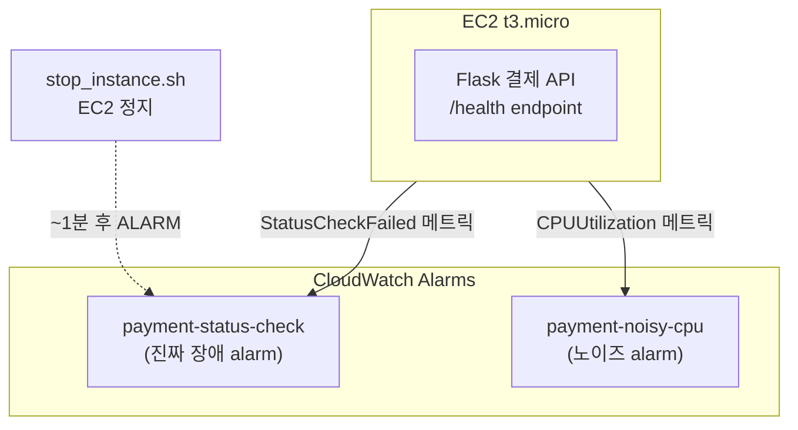

# Phase 0 — EC2 시뮬레이터 + CloudWatch Alarm

> 워크샵의 첫 번째 단계입니다. **결제 서비스 EC2**와 **CloudWatch Alarm**을 만들어서, 이후 단계에서 AI Agent가 분석할 "장애 상황"을 준비합니다.

---

## 이 Phase에서 만드는 것



**만들어지는 자원:**
- EC2 t3.micro 1대 (Flask 결제 API 서버)
- CloudWatch Alarm 2개
  - `payment-xxx-status-check` — EC2가 죽으면 발생하는 **진짜 장애**
  - `payment-xxx-noisy-cpu` — CPU 0.5% 초과 시 발생하는 **노이즈** (거의 항상 울림)

---

## 왜 필요한가?

이후 Phase에서 AI Agent가 이 Alarm을 분석합니다.

| Phase | 역할 |
|-------|------|
| Phase 2 | Gateway가 CloudWatch Alarm 데이터를 가져옴 |
| Phase 3 | Monitor Agent가 Alarm을 **real vs noise** 분류 |
| Phase 4 | Incident Agent가 장애 원인 진단 |
| Phase 5 | Supervisor가 전체 orchestration |

---

## Step 1. 프로젝트 클론

먼저 워크샵 코드를 다운로드합니다.

```bash
git clone https://github.com/gonsoomoon-ml/aiops-multi-agent-workshop.git
cd aiops-multi-agent-workshop
```

---

## Step 2. 환경 초기화 (bootstrap)

워크샵 환경을 초기화합니다.

```bash
bash bootstrap.sh
```

**bootstrap.sh가 하는 일:**
1. Python 패키지 설치 (`uv sync`)
2. `.env` 파일 생성 (설정 파일)
3. `DEMO_USER` 이름 자동 생성 (예: `user01`, `kim`, `workshop-abc`)
4. AWS Region 설정

> 완료되면 `.env` 파일이 생성됩니다. 이 파일에 워크샵 설정이 저장됩니다.

---

## Step 3. EC2 + Alarm 배포

```bash
bash infra/ec2-simulator/deploy.sh
```

약 3분 정도 걸립니다. 완료되면

```
[deploy] Phase 0 배포 완료
  Payment API : http://1.2.3.4:8080/health
  alarm 2종   : payment-user01-status-check (real) / payment-user01-noisy-cpu (noise)
```

배포 후 환경변수를 현재 터미널에 적용합니다.

```bash
source .env
```

---

## Step 4. 배포 확인

### 4-1. Alarm 확인

CloudWatch에 Alarm 2개가 생성되었는지 확인합니다.

```bash
aws cloudwatch describe-alarms \
  --alarm-name-prefix "payment-${DEMO_USER}-" \
  --region "$AWS_REGION" \
  --query 'MetricAlarms[].[AlarmName,StateValue,MetricName]' \
  --output table
```

**기대 결과** (둘 다 OK 상태)
```
+--------------------------------------+--------+---------------------------+
| payment-user01-noisy-cpu             | OK     | CPUUtilization            |
| payment-user01-status-check          | OK     | StatusCheckFailed         |
+--------------------------------------+--------+---------------------------+
```

### 4-2. Flask API 확인

EC2가 부팅되는데 2~3분 걸립니다. 기다린 후 확인합니다.

```bash
curl http://$EC2_PUBLIC_IP:8080/health
```

**기대 결과:**
```json
{"status":"ok"}
```

---

## Step 5. 장애 시뮬레이션 (Chaos)

이제 EC2를 정지시켜서 **진짜 장애 상황**을 만듭니다.

```bash
bash infra/ec2-simulator/chaos/stop_instance.sh
```

약 1분 후 Alarm이 발생합니다. 확인합니다.

```bash
aws cloudwatch describe-alarms \
  --alarm-names "payment-${DEMO_USER}-status-check" \
  --region "$AWS_REGION" \
  --query 'MetricAlarms[0].StateValue' \
  --output text
```

**기대 결과:** `ALARM`

> 이 ALARM 상태를 유지한 채로 Phase 2~5를 진행합니다. AI Agent가 이 Alarm을 분석하게 됩니다.

---

## Step 6. (선택) 복원하기

워크샵 종료 후 EC2를 다시 시작하려면 아래 명령을 실행합니다.

```bash
bash infra/ec2-simulator/chaos/start_instance.sh
```

1~2분 후 Alarm이 OK로 돌아옵니다.

---

## 통과 기준

- [ ] EC2 + 2개 Alarm 배포 성공
- [ ] `/health` 응답 정상 (`{"status":"ok"}`)
- [ ] `stop_instance.sh` 실행 → Alarm 상태가 `ALARM`으로 변경

---

## Real vs Noise Alarm 차이

| | Real Alarm | Noise Alarm |
|---|---|---|
| **이름** | `payment-xxx-status-check` | `payment-xxx-noisy-cpu` |
| **발생 조건** | EC2가 죽으면 | CPU가 0.5% 넘으면 (거의 항상) |
| **의미** | 진짜 장애 | 무시해도 되는 노이즈 |
| **AI Agent 역할** | 이걸 찾아서 대응 | 이걸 걸러내기 |

---

## 다음 단계

→ [Phase 1 — Local Strands Agent](/learn/phase1.md)

---

## 정리 (Teardown)

Phase 0만 정리하려면 아래 명령을 실행합니다.
```bash
bash infra/ec2-simulator/teardown.sh
```

전체 워크샵 정리
```bash
bash teardown_all.sh
```
