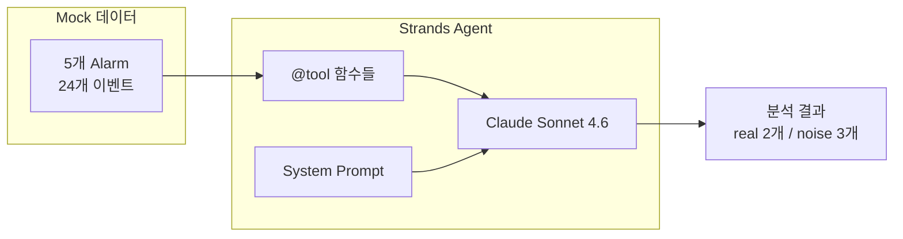
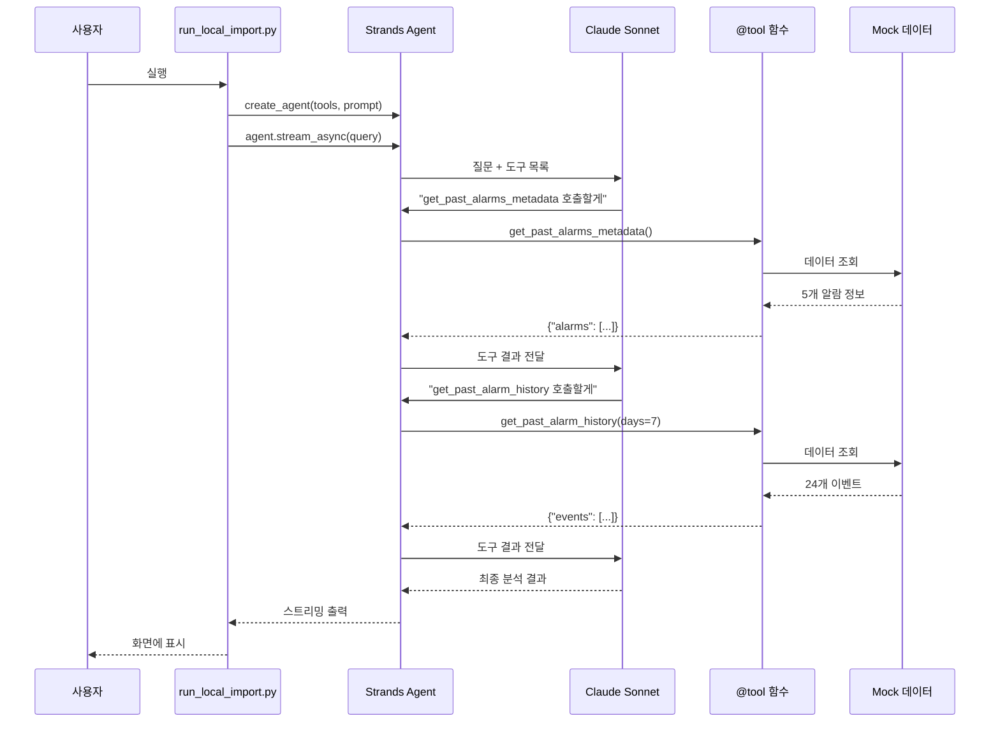
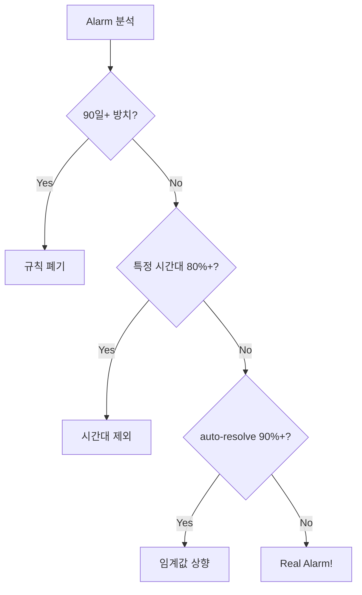

# Phase 1 — 로컬 Monitor Agent (Strands + Mock 데이터)

> 드디어 **AI Agent**가 등장합니다! 이 Phase에서는 Mock 데이터로 **Strands Agent**를 실행하고, LLM이 Alarm을 분석하는 과정을 체험합니다.

---

## 이 Phase에서 하는 것



**핵심 포인트:**
- AWS 자원 생성 **없음** — Bedrock API만 사용
- Mock 데이터로 빠르게 실행 (~5초)
- LLM Agent의 동작 원리 학습

---

## 왜 필요한가?

Phase 1에서 배우는 것

| 학습 포인트 | 설명 |
|------------|------|
| **Strands Agent 구조** | `Agent(model, tools, prompt)` — 이게 전부! |
| **@tool decorator** | Python 함수를 LLM 도구로 만드는 방법 |
| **3가지 진단 유형** | noise alarm을 분류하는 패턴 학습 |

---

## Step 1. 환경 확인

Phase 0에서 이미 `bootstrap.sh`를 실행했다면 건너뛰어도 됩니다.

```bash
bash bootstrap.sh
```

**필요한 것:**
- AWS 자격증명 (Bedrock API 호출용)
- Claude Sonnet 4.6 모델 접근 권한

> Phase 0의 EC2는 필요 없습니다. 이 Phase는 Mock 데이터만 사용합니다.

---

## Step 2. Agent 실행

```bash
uv run python -m agents.monitor.local.run_local_import
```

약 5~15초 후 결과가 출력됩니다.

---

## Step 3. 결과 확인

**기대 출력:**

```
============================================================
Monitor Agent — Phase 1 frozen baseline (mock 직접 import)
Model: global.anthropic.claude-sonnet-4-6
============================================================

── 1. 알람 현황 ──
🔍 알람 현황 — 지난 7일 / 총 5개

⚠️ legacy-2018-server-cpu    │ noise │ 발화 1 │ ack 0/1 │ 조치 0/1 │ 100일
🟡 nightly-batch-cpu         │ noise │ 발화 3 │ ack 0/3 │ 조치 0/3 │  30일 │ ★ 02시만
🟡 web-server-memory-routine │ noise │ 발화 4 │ ack 0/4 │ 조치 0/4 │  60일
🔴 web-server-cpu-high       │ real  │ 발화 2 │ ack 2/2 │ 조치 2/2 │   7일
🔴 payment-api-5xx-errors    │ real  │ 발화 2 │ ack 2/2 │ 조치 2/2 │  14일

── 2. 개선 권고 ──

[1] legacy-2018-server-cpu — 규칙 폐기
    판단 근거: 알람 나이 100일(>= 90일), 방치된 알람
    제안 조치: 규칙 삭제

[2] nightly-batch-cpu — 시간대 제외
    판단 근거: 발화 3건 모두 02시대(100%). 야간 배치 작업 패턴
    제안 조치: UTC 02~04시 suppression 추가

[3] web-server-memory-routine — 임계값 상향
    판단 근거: 모두 auto-resolve(100%)
    제안 조치: 임계값 70% → 90%로 상향

── 3. 실제로 봐야 할 알람 ──
- web-server-cpu-high
- payment-api-5xx-errors
```

---

## 코드로 이해하는 Strands Agent

### 실행 파일: `run_local_import.py`

```python
# agents/monitor/local/run_local_import.py

from agents.monitor.shared.agent import create_agent
from agents.monitor.shared.tools.alarm_history import (
    get_past_alarm_history,
    get_past_alarms_metadata,
)

async def _amain(query: str) -> None:
    # Agent 생성 — 도구 2개 + system prompt 파일 지정
    agent = create_agent(
        tools=[get_past_alarms_metadata, get_past_alarm_history],
        system_prompt_filename="system_prompt_past.md",
    )
    
    # 스트리밍 응답
    async for event in agent.stream_async(query):
        print(event.get("data", ""), end="", flush=True)
```

**핵심:** `create_agent()`에 **도구**와 **프롬프트**를 넘기면 끝!

---

### Agent 생성: `agent.py`

```python
# agents/monitor/shared/agent.py

from strands import Agent
from strands.models import BedrockModel

def create_agent(tools: list, system_prompt_filename: str) -> Agent:
    # 1. Bedrock 모델 설정
    model = BedrockModel(
        model_id="global.anthropic.claude-sonnet-4-6",
        region_name="us-east-1",
        cache_tools="default",  # 도구 스키마 캐싱
    )
    
    # 2. System Prompt 로드
    prompt_text = load_system_prompt(system_prompt_filename)
    
    # 3. Agent 생성 — 이게 전부!
    return Agent(
        model=model,
        tools=tools,
        system_prompt=[
            SystemContentBlock(text=prompt_text),
            SystemContentBlock(cachePoint={"type": "default"}),  # 프롬프트 캐싱
        ],
    )
```

**Strands Agent 구성 요소:**
| 요소 | 역할 |
|------|------|
| `model` | LLM 모델 (Claude Sonnet 4.6) |
| `tools` | Agent가 호출할 수 있는 함수들 |
| `system_prompt` | LLM에게 주는 지시사항 |

---

### @tool 데코레이터: `alarm_history.py`

```python
# agents/monitor/shared/tools/alarm_history.py

from strands import tool

@tool
def get_past_alarms_metadata() -> Dict[str, List[Dict]]:
    """과거 5개 mock 알람의 metadata를 반환한다."""
    return {"alarms": _mock_get_past_alarms_metadata()}

@tool
def get_past_alarm_history(days: int = 7) -> Dict[str, List[Dict]]:
    """과거 mock history 이벤트를 반환한다.
    
    Args:
        days: 최근 며칠 분 history 반환
    """
    return {"events": _mock_get_past_alarm_history(days=days)}
```

**`@tool` 데코레이터가 하는 일:**
1. Python 함수를 LLM이 호출 가능한 도구로 변환
2. docstring → 도구 설명 (LLM이 읽음)
3. 파라미터 타입 → JSON Schema 자동 생성

---

### 전체 흐름 요약



---

## 통과 기준

- [ ] 5개 알람 모두 분류됨 (real 2 + noise 3)
- [ ] 3가지 noise 진단 유형 정확히 매칭
  - `legacy-2018-server-cpu` → 규칙 폐기
  - `nightly-batch-cpu` → 시간대 제외
  - `web-server-memory-routine` → 임계값 상향
- [ ] Section 3에 real 2개만 나열

---

## 3가지 진단 유형 이해하기

AI Agent가 noise alarm을 분류하는 3가지 패턴

| 진단 유형 | 조건 | 제안 조치 |
|----------|------|----------|
| **규칙 폐기** | 90일 이상 + ack 0건 | 알람 삭제 |
| **시간대 제외** | 특정 2시간대에 80%+ 발생 | suppression 윈도우 추가 |
| **임계값 상향** | auto-resolve 90%+ | 임계값 올리기 |



---

## 핵심 파일 구조

```
agents/monitor/
├── shared/
│   ├── agent.py                    # create_agent() 함수
│   ├── prompts/
│   │   └── system_prompt_past.md   # LLM 지시사항 (진단 유형 정의)
│   └── tools/
│       └── alarm_history.py        # @tool 함수 2개
└── local/
    └── run_local_import.py         # Phase 1 실행 파일
```

---

## (선택) Custom Query로 실행

특정 알람만 분석하고 싶다면

```bash
uv run python -m agents.monitor.local.run_local_import \
  --query "legacy-2018-server-cpu 알람만 분석해서 noise 여부와 근거를 자세히 설명해줘."
```

---

## 다음 단계

→ [Phase 2 — Gateway + MCP](/learn/phase2.md)

Phase 2에서는 Mock 대신 **실제 CloudWatch API**를 호출하도록 변경합니다. 
**Agent 코드는 그대로** — 도구만 MCP로 교체!

---

## 참고 파일

| 파일 | 설명 |
|------|------|
| `agents/monitor/local/run_local_import.py` | 실행 진입점 |
| `agents/monitor/shared/agent.py` | Agent 생성 팩토리 |
| `agents/monitor/shared/tools/alarm_history.py` | @tool 래퍼 |
| `agents/monitor/shared/prompts/system_prompt_past.md` | System Prompt |
| `data/mock/phase1/alarm_history.py` | Mock 데이터 |
