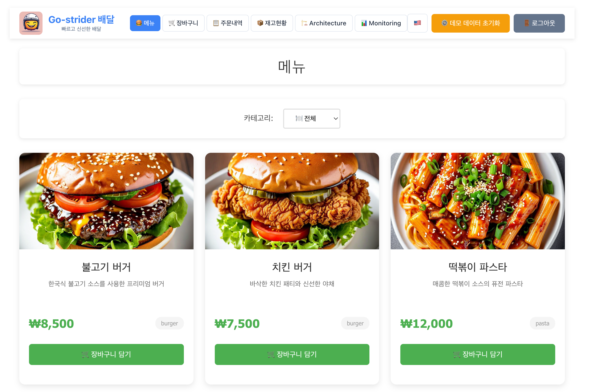
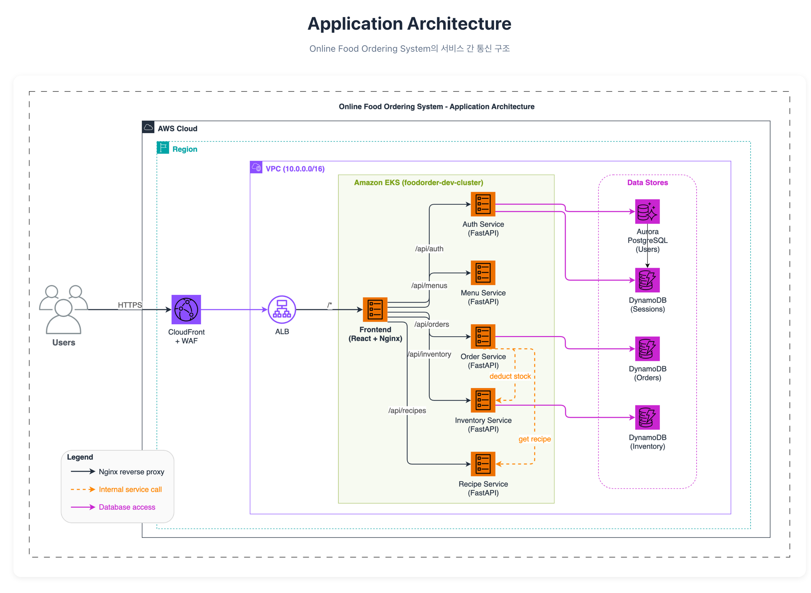

# Phase 6 — Cross-Account Monitoring (IAM User Access Key)

> Phase 6 는 **다른 AWS 계정 (Sample App Account) 의 CloudWatch Alarm** 을 기존 Monitor Agent 가 분석할 수 있도록 **IAM User Access Key 기반 cross-account Lambda 호출**을 구성. Workshop Account 의 Lambda 가 전달받은 Access Key 로 Sample App Account 의 Proxy Lambda 를 직접 invoke 하고, Proxy Lambda 가 자기 계정의 CloudWatch 를 읽어 응답.

---

## 1. 왜 필요한가   *(~3 min read)*

엔터프라이즈 환경에서 모니터링 대상은 단일 계정에 국한되지 않음. 운영팀은 여러 AWS 계정의 alarm 을 **하나의 Agent** 로 통합 분석해야 함.

| 동기 | Phase 5 까지의 범위 | Phase 6 에서 추가로 다루는 내용 |
|---|---|---|
| **Multi-account 가시성** | 단일 계정 내 alarm 조회 | Sample App Account 의 alarm 을 Proxy Lambda 경유로 통합 조회 |
| **최소 노출 원칙** | 단일 계정 IAM 구성 | 전용 IAM User 가 단일 Lambda invoke 권한만 보유 |
| **Enterprise 패턴 학습** | 단일 계정 IAM 구성 | Cross-account credential 전달 + Lambda invoke 패턴 실습 |

---

## 2. 모니터링 대상 — Food Order Sample App

Phase 6 의 모니터링 대상은 별도 AWS 계정에 배포된 **Food Order 데모 애플리케이션**입니다.

**서비스 URL**: [https://demo.my-awsome-app.xyz/](https://demo.my-awsome-app.xyz/)



**아키텍처 구성**



이 애플리케이션에서 발생하는 CloudWatch Alarm 을 Workshop Account 의 Agent 가 분석합니다. Sample App Account 에는 Proxy Lambda 가 배포되어 있으며, Workshop Account 는 전용 IAM User Access Key 로 이 Lambda 를 invoke 합니다.

---

## 3. 진행 (Hands-on)   *(설정 ~10 min / 검증 ~5 min)*

### 3-1. 사전 확인

- **Phase 5 완료** (Supervisor + 2 sub-agent Runtime READY)
- AWS 자격 증명 + `source .env`
- **행사 진행 AWS 직원에게 아래 정보를 전달받으세요:**

| 항목 | 설명 |
|---|---|
| `SOURCE_LAMBDA_ARN` | Sample App Proxy Lambda ARN |
| `SOURCE_ACCESS_KEY_ID` | 전용 IAM User Access Key ID |
| `SOURCE_SECRET_ACCESS_KEY` | 전용 IAM User Secret Access Key |
| `SOURCE_REGION` | Proxy Lambda region |

> **Sample App Account 설정은 행사 진행자가 사전 완료합니다.** 전용 IAM User 는 해당 Proxy Lambda 의 `lambda:InvokeFunction` 권한만 보유합니다.

### 3-2. Deploy

#### Step A — `.env` 에 Cross-Account 정보 추가

행사 진행자에게 전달받은 값을 입력합니다:

```bash
cd /workshop/aiops-multi-agent-workshop

cat >> .env << 'EOF'
SOURCE_LAMBDA_ARN=<전달받은 Proxy Lambda ARN>
SOURCE_ACCESS_KEY_ID=<전달받은 Access Key ID>
SOURCE_SECRET_ACCESS_KEY=<전달받은 Secret Access Key>
SOURCE_REGION=<전달받은 Region>
EOF
source .env
```

#### 동작 확인 — Lambda invoke 테스트 (선택)

`.env` 설정 후, 전달받은 credential 로 Proxy Lambda 를 직접 호출해 연결을 확인합니다:

```bash
cd /workshop/aiops-multi-agent-workshop
set -a; source .env; set +a

uv run python -c "
import boto3, json, os

client = boto3.client('lambda',
    region_name=os.environ['SOURCE_REGION'],
    aws_access_key_id=os.environ['SOURCE_ACCESS_KEY_ID'],
    aws_secret_access_key=os.environ['SOURCE_SECRET_ACCESS_KEY'])

resp = client.invoke(
    FunctionName=os.environ['SOURCE_LAMBDA_ARN'],
    InvocationType='RequestResponse',
    Payload=json.dumps({'action': 'list_alarms'}))

print(json.dumps(json.loads(resp['Payload'].read()), indent=2, ensure_ascii=False))
"
```

기대: Sample App Account 의 alarm 목록이 JSON 으로 반환.

#### Step B — 배포

```bash
cd /workshop/aiops-multi-agent-workshop
bash infra/phase6/deploy.sh
```

이 스크립트가 자동으로 수행하는 작업:
1. `cognito.yaml` 에 `SOURCE_*` CFN Parameters + Lambda 환경변수 추가
2. `deploy.sh` 의 `--parameter-overrides` 에 `SOURCE_*` 전달 추가
3. `handler.py` 를 cross-account Lambda invoke 버전으로 교체 (원본은 `.bak` 백업)
4. CFN 재배포

> **IAM Role 변경 불필요** — explicit credential 사용이므로 execution role 무관.

### 3-3. 검증

#### Supervisor 를 통한 Sample App Account alarm 분석

Phase 5 에서 배포한 Supervisor Runtime 에 질문하여 cross-account alarm 을 분석합니다:

```bash
set -a; source .env; set +a
uv run agents/supervisor/runtime/invoke_runtime.py --query "현재 알람 상태를 분석하고 진단해줘"
```

기대: Supervisor 가 Monitor A2A → cloudwatch_wrapper Lambda → (Access Key) → Sample App Proxy Lambda → CloudWatch 경로로 alarm 을 조회하고, Incident A2A 를 통해 진단 결과까지 통합 반환.

#### Lambda 로그 확인

```bash
aws logs tail "/aws/lambda/aiops-demo-${DEMO_USER}-cloudwatch-wrapper" \
  --since 5m --region "${AWS_REGION:-us-east-1}"
```

에러 없이 alarm 응답이 반환되면 성공.

#### 통과 기준

- Lambda 가 전달받은 Access Key 로 Sample App Proxy Lambda 를 정상 invoke
- Agent 가 cross-account alarm 에 대해 분석 수행
- Supervisor end-to-end 호출 시 정상 JSON 응답 반환

### 3-4. 정리

**Workshop Lambda 원복**:

```bash
cd /workshop/aiops-multi-agent-workshop/infra/cognito-gateway/lambda/cloudwatch_wrapper
cp handler.py.bak handler.py

# cognito.yaml + deploy.sh 원복
cd /workshop/aiops-multi-agent-workshop
git checkout -- infra/cognito-gateway/cognito.yaml infra/cognito-gateway/deploy.sh

# 재배포
bash infra/cognito-gateway/deploy.sh
```

**완전 정리** (모든 phase 자원 일괄):

```bash
bash teardown_all.sh
```

---

## 4. 무엇을 만드나   *(~3 min read)*

```
┌─────────────────────────────────────────────────────────────────────────────┐
│                       Workshop Account                                       │
│                                                                             │
│  ┌──────────────┐       ┌──────────────────┐       ┌─────────────────────┐  │
│  │ Strands Agent│──MCP─▶│ AgentCore Gateway│──────▶│ cloudwatch_wrapper  │  │
│  │ (Supervisor  │ Bearer│ (CUSTOM_JWT)     │ IAM   │ Lambda              │  │
│  │  → Monitor)  │  JWT  │                  │invoke │                     │  │
│  └──────────────┘       └──────────────────┘       └──────────┬──────────┘  │
│                                                               │             │
│                                              boto3 lambda:Invoke            │
│                                              (explicit Access Key)          │
│                                                               │             │
└───────────────────────────────────────────────────────────────┼─────────────┘
                                                                │
                                                                ▼
┌─────────────────────────────────────────────────────────────────────────────┐
│                       Sample App Account                                     │
│                                                                             │
│  ┌──────────────────────────────────────────────────────────┐               │
│  │ Proxy Lambda                                             │               │
│  │  - IAM User: foodorder-dev-workshop-cw-invoker           │               │
│  │    (lambda:InvokeFunction — 이 Lambda 만)                 │               │
│  │  - 내부: boto3 cloudwatch read (자기 계정)                  │               │
│  └──────────────────────────────┬───────────────────────────┘               │
│                                 │                                           │
│                                 ▼                                           │
│  ┌──────────────────────────────────────────────┐                           │
│  │ CloudWatch Alarms                            │                           │
│  │  └─ foodorder-dev-* alarms                   │                           │
│  └──────────────────────────────────────────────┘                           │
│                                                                             │
└─────────────────────────────────────────────────────────────────────────────┘
```

**핵심**: Workshop 계정의 Lambda 가 전달받은 IAM User Access Key 로 boto3 client 를 생성하여 Sample App Proxy Lambda 를 `lambda:Invoke`. Cross-account resource-based policy 없음, role assumption 없음. IAM User 가 자기 계정의 Lambda 를 invoke 할 뿐.

---

## 5. 어떻게 동작   *(~5 min read)*

### 인증 흐름

```
Workshop Lambda                    Sample App Account
      │                                   │
      │ ① boto3.client("lambda",          │
      │    access_key_id=...,             │
      │    secret_access_key=...)         │
      │                                   │
      │ ② lambda:Invoke (SDK 호출)         │
      │   (SigV4 자동 — SDK 내부)          │
      ├──────────────────────────────────▶│ Proxy Lambda
      │                                   │
      │                                   │ ③ IAM User 권한 검증
      │                                   │   (lambda:InvokeFunction 허용)
      │                                   │
      │                                   │ ④ 자기 계정 CloudWatch 조회
      │                                   │   (Lambda execution role 권한)
      │                                   │
      │ ⑤ alarm 데이터 응답                   │
      │◀──────────────────────────────────┤
```

### Sample App Account 구성 (행사 진행자가 사전 설정)

| 자원 | 설명 |
|---|---|
| **Proxy Lambda** | CloudWatch alarm 읽기 전용 API 제공 |
| **IAM User** | 전용 user (경로: `/workshop/`) |
| **IAM Policy** | `lambda:InvokeFunction` — Proxy Lambda ARN 만 허용 |
| **Access Key** | Workshop 중 참가자에게 전달, 종료 후 삭제 |

### Workshop Account 구성 (참가자 실행)

| 자원 | 변경 내용 |
|---|---|
| **`cognito.yaml` — 환경변수** | `CloudWatchWrapperLambda` 에 `SOURCE_*` 4개 추가 |
| **`handler.py` 코드** | Access Key 기반 Lambda invoke 로직으로 교체 |
| **IAM Role** | **변경 없음** — explicit credential 사용이므로 execution role 무관 |

### 시퀀스 다이어그램 (End-to-End)

```
Operator  Supervisor  Monitor_A2A  Gateway  CW_Lambda       Proxy_Lambda    CW
   │          │           │          │          │                │           │
   │  query   │           │          │          │                │           │
   ├─────────▶│           │          │          │                │           │
   │          │  A2A call │          │          │                │           │
   │          ├──────────▶│          │          │                │           │
   │          │           │ MCP tool │          │                │           │
   │          │           ├─────────▶│          │                │           │
   │          │           │          │  invoke  │                │           │
   │          │           │          ├─────────▶│                │           │
   │          │           │          │          │                │           │
   │          │           │          │          │ lambda:Invoke  │           │
   │          │           │          │          │ (Access Key)   │           │
   │          │           │          │          ├───────────────▶│           │
   │          │           │          │          │                │ describe  │
   │          │           │          │          │                ├──────────▶│
   │          │           │          │          │                │  alarms   │
   │          │           │          │          │                │◀──────────┤
   │          │           │          │          │ JSON response  │           │
   │          │           │          │          │◀───────────────┤           │
   │          │           │          │          │                │           │
   │          │           │  result  │          │                │           │
   │          │           │◀─────────┤◀─────────┤                │           │
   │          │  response │          │          │                │           │
   │          │◀──────────┤          │          │                │           │
   │  answer  │           │          │          │                │           │
   │◀─────────┤           │          │          │                │           │
```

### 트러블슈팅

| 증상 | 원인 | 해결 |
|---|---|---|
| `AccessDeniedException` | Access Key 의 IAM User 에 invoke 권한 없음 | 행사 진행자에게 확인 요청 |
| `ResourceNotFoundException` | Lambda ARN 오타 | `SOURCE_LAMBDA_ARN` 값 재확인 |
| `InvalidSignatureException` | Secret Access Key 오타 또는 만료 | 행사 진행자에게 key 재발급 요청 |
| Lambda timeout | Proxy Lambda 응답 지연 | Lambda timeout 15초 → 30초 증가 검토 |
| 기존 alarm 조회 안 됨 | handler 교체 후 자기 계정 조회 불가 | 원본 handler 복원 (`cp handler.py.bak handler.py`) |

---

## 6. 보안 고려사항

| 항목 | 조치 |
|---|---|
| Access Key 노출 범위 | Lambda 환경변수에만 저장 — 코드 repo 에 commit 금지 |
| 권한 최소화 | IAM User 는 단일 Lambda ARN 의 `lambda:InvokeFunction` 만 보유 |
| Key 수명 관리 | Workshop 종료 후 행사 진행자가 Access Key 삭제/비활성화 |
| Proxy Lambda 범위 | CloudWatch read-only — `DescribeAlarms`, `DescribeAlarmHistory` 만 |

---

## 7. References

| 자료 | 용도 |
|---|---|
| [IAM User Access Keys](https://docs.aws.amazon.com/IAM/latest/UserGuide/id_credentials_access-keys.html) | Access Key 개념 |
| [boto3 Lambda invoke](https://boto3.amazonaws.com/v1/documentation/api/latest/reference/services/lambda/client/invoke.html) | Lambda SDK 호출 |
| [`infra/cognito-gateway/cognito.yaml`](../../infra/cognito-gateway/cognito.yaml) | CloudWatchWrapperLambda 원본 |
| [`docs/learn/phase2.md`](phase2.md) | Gateway + Lambda 기본 구조 (Phase 6 의 기반) |
| [`docs/learn/phase5.md`](phase5.md) | Supervisor + A2A 구조 (Phase 6 검증에 사용) |
