# Workshop 환경 구성

> Workshop Studio에서 제공하는 IAM Identity Center 계정으로 Kiro를 활성화하고,
> Code Server EC2에 필수 소프트웨어를 설치하는 가이드입니다.

---

## 1. Workshop Studio 출력값 확인

Workshop Studio **Event Outputs** 페이지로 이동하여 아래 값을 기록해 두세요.

| Key | 설명 |
|---|---|
| `IDC-passwordotp` | 초기 임시 비밀번호 (**강조 표시**) |
| `IDC-region` | Identity Center Region (예: `us-east-1`) |
| `IDC-sso-starturl` | Identity Center Start URL (**강조 표시**) |
| `IDC-useremail` | Identity Center User Email (예: `qdev@example.com`) |
| `IDC-username` | Identity Center Username (예: `qdev`) |
| `VSCode-Password` | Code Server 접속 비밀번호 |
| `VSCode-ServerURL` | Code Server URL (CloudFront URL) |

> `IDC-passwordotp`와 `IDC-sso-starturl` 두 값은 이후 단계에서 반드시 사용하므로 별도로 기록해 두세요.

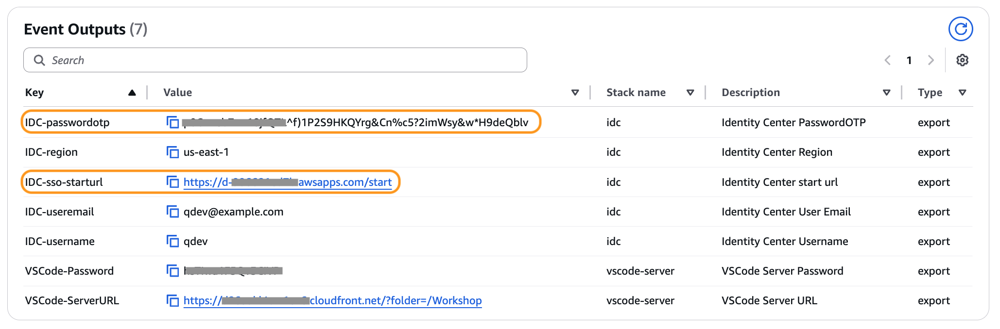

---

## 2. IAM Identity Center 비밀번호 초기화

### Step 1 — SSO Portal 접속 및 로그인

브라우저에서 `IDC-sso-starturl` 값으로 접속하세요. 아래 3단계 순서로 진행하세요.

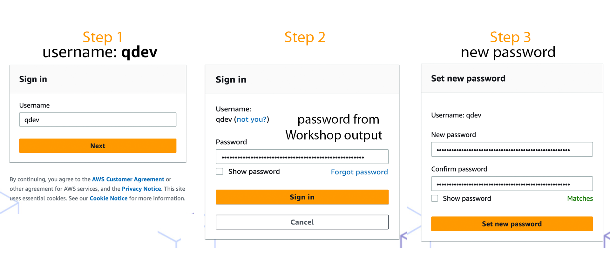

**Step 1** — Username 입력 후 **Next** 클릭
- Username: `IDC-username` 값 (예: `qdev`)

**Step 2** — Password 입력 후 **Sign in** 클릭
- Password: `IDC-passwordotp` 값 (Workshop output의 임시 비밀번호)

**Step 3** — 새 비밀번호 설정 후 **Set new password** 클릭
- 아래 조건을 충족하는 새 비밀번호를 입력하고 Confirm password에 동일하게 입력하세요.
  - 8–64자
  - 대문자 및 소문자 포함
  - 숫자 포함
  - 영숫자가 아닌 특수문자 포함

재설정 완료 후 **AWS access portal**로그인 된 상태를 유지합니다. 로그인 되어있지 않다면, 브라우저에서 `IDC-sso-starturl` 값으로 접속 하세요. 

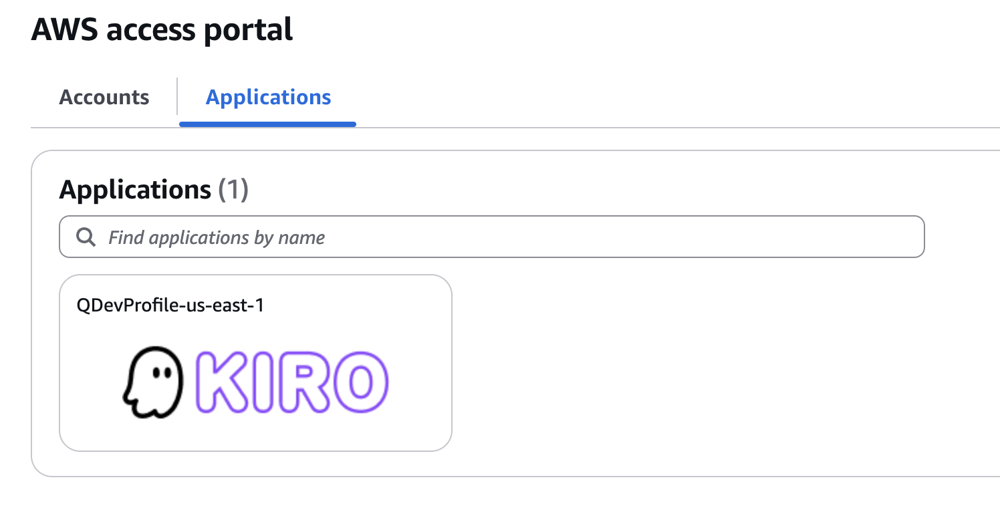

> 비밀번호 재설정이 완료되었습니다. 이 창은 닫으세요.

---

## 3. Code Server 접속

브라우저에서 `VSCode-ServerURL` 값으로 접속하세요. 비밀번호 입력 화면이 나오면 `VSCode-Password` 값을 입력하세요.

접속 후 상단 메뉴 **Terminal → New Terminal**로 터미널을 여세요.

---

## 4. Kiro CLI 로그인

### Step 1 — 로그인 명령 실행

Code Server 터미널에서 아래 명령을 실행하세요.

```bash
kiro-cli login --use-device-flow
```

프롬프트가 표시되면 아래와 같이 입력하세요.

| 프롬프트 | 입력값 |
|---|---|
| Select login method | `Use with IDC Account` 선택 |
| Enter Start URL | `IDC-sso-starturl` 값 |
| Enter Region | `IDC-region` 값 (예: `us-east-1`) |

입력 완료 후 아래와 같이 인증 URL과 코드가 출력됩니다.

```
✔ Select login method · Use with IDC Account
✔ Enter Start URL · https://d-xxxxxxxxxx.awsapps.com/start
✔ Enter Region · us-east-1

Confirm the following code in the browser
Code: XXXX-XXXX

▰▰▰▱▱▱▱ Logging in...
```

### Step 2 — 브라우저에서 인증 URL 접속

터미널에 출력된 URL을 복사해 브라우저에서 여세요.

```
https://d-xxxxxxxxxx.awsapps.com/start/#/device?user_code=XXXX-XXXX
```

### Step 3 — 3단계에서 설정한 ID/PW로 로그인

브라우저 로그인 화면에서 아래 정보를 입력하세요.
- Username: `IDC-username` 값
- Password: **3단계에서 새로 설정한 비밀번호**

### Step 4 — 인증 코드 확인 및 Kiro 액세스 허용

**Authorization requested** 화면이 표시되면, 터미널의 코드와 화면의 코드가 일치하는지 확인 후 **Confirm and continue** 를 클릭하세요.

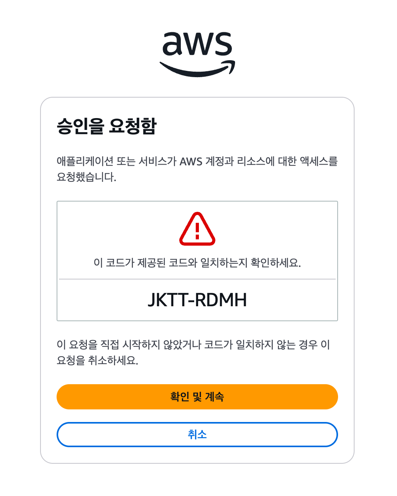

이어서 **Allow Kiro CLI to access your data?** 화면이 표시되면 **Allow access** 를 클릭하세요.

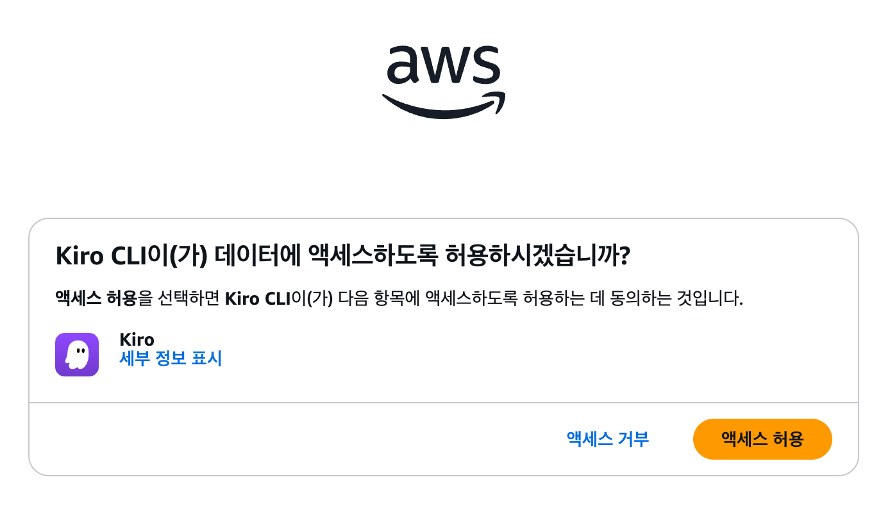

**Request approved** 화면이 표시되면 승인이 완료된 것입니다. 브라우저 창을 닫고 터미널로 돌아오세요.

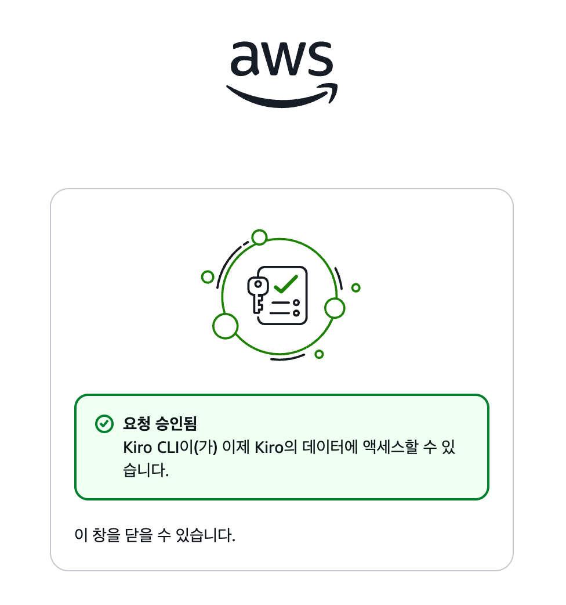

### Step 5 — 로그인 완료 확인

Code Server 터미널에서 `Logged in successfully` 메시지를 확인하세요.

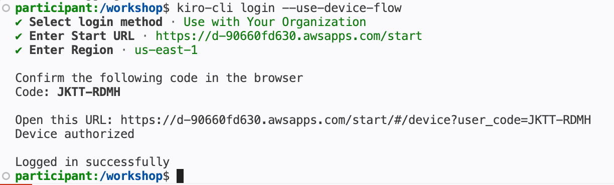

버전을 확인하고 Kiro Chat을 시작하세요.

```bash
kiro-cli --version
kiro-cli chat
```

다음 이미지와 같이 표시되면 kiro-cli 활성화가 완료 된 것 입니다. 

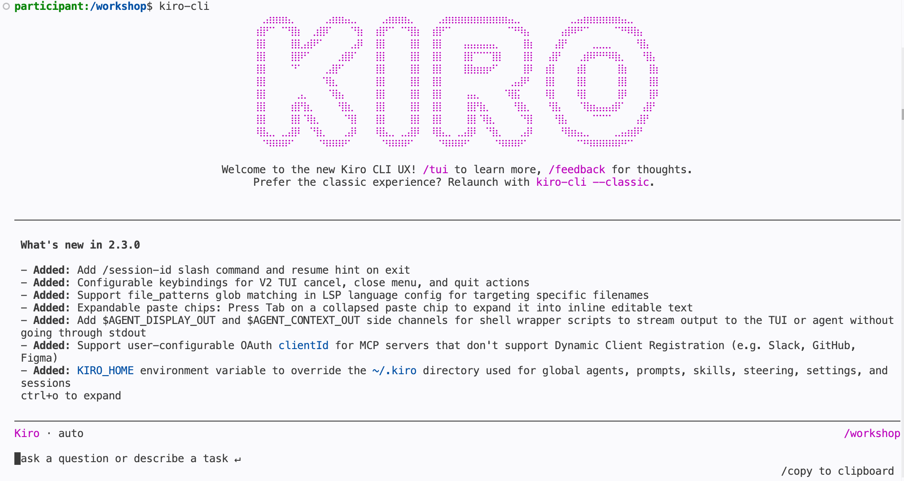

채팅 세션에서 `/model` 명령으로 모델을 선택할 수 있습니다. 

```
/model
```

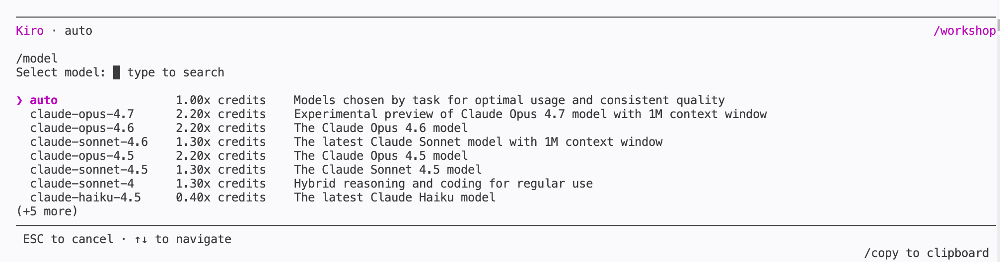

> `Auto` 모드는 작업 유형에 따라 최적 모델을 자동으로 선택합니다. 본 워크샵에서는 기본값을 유지하세요.

축하합니다! 이제 Kiro CLI와 채팅할 준비가 되었습니다.

---

## 4. pre-requesite.sh 실행 (SSM Session Manager)

### Step 1 — EC2 인스턴스 선택 및 Connect

AWS Console에서 **EC2 → Instances**로 이동하세요. `CodeServer` 인스턴스가 **Running** 상태인지 확인하세요.

1. `CodeServer` 인스턴스를 체크박스로 선택하세요.
2. **Connect** 버튼을 클릭하세요.

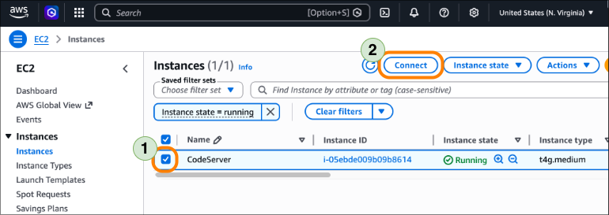

### Step 2 — SSM Session Manager로 접속

**Connect to instance** 화면에서 **SSM Session Manager** 탭을 선택하세요.

SSM agent 상태가 **Online** / **Connected**인지 확인한 후 **Connect** 버튼을 클릭하세요.

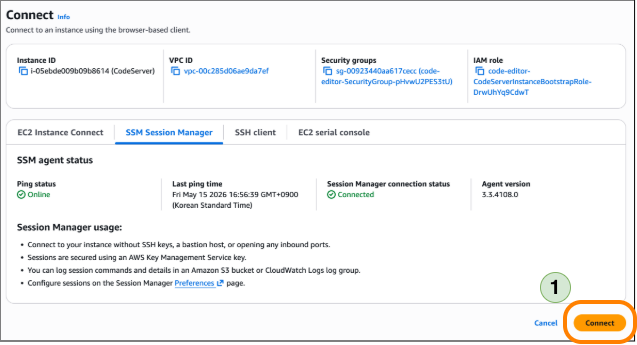

### Step 3 — bash shell로 전환

SSM Session Manager로 접속하면 기본 shell이 `sh`입니다. 먼저 `bash`로 전환하세요.

```bash
bash
```

### Step 4 — pre-requesite.sh 다운로드

아래 명령어로 환경 설정 스크립트를 다운로드하고 실행 권한을 부여하세요.

```bash
curl -fsSL https://raw.githubusercontent.com/gonsoomoon-ml/aiops-multi-agent-workshop/refs/heads/main/pre-requesite.sh -o pre-requesite.sh && chmod +x pre-requesite.sh && ls -l
```

아래와 같이 `pre-requesite.sh` 파일이 생성된 것을 확인하세요.

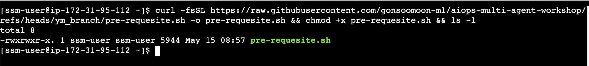

### Step 5 — pre-requesite.sh 실행

다운로드한 스크립트를 실행하세요.

```bash
./pre-requesite.sh
```

정상적으로 완료되면 아래와 같이 `Prerequisite setup complete!` 메시지를 확인할 수 있습니다.

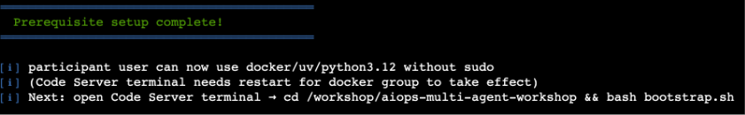

> Code Server 터미널에서 docker 명령을 사용하려면 터미널을 재시작해야 합니다.

---

## 5. 다음 단계

→ [`phase0.md`](phase0.md) — EC2 시뮬레이터 + CloudWatch Alarm 배포
